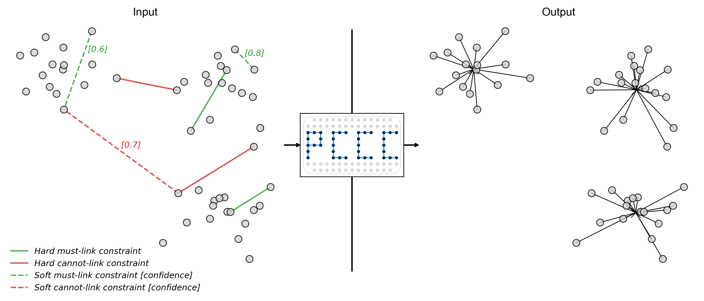

<h1 align="center">
  <br>
  
  

</h1>

An algorithm for clustering with hard and soft must-link and cannot-link constraints. A detailed description of the algorithm can be found in https://arxiv.org/abs/2212.14437. The data of the paper is available under https://github.com/phil85/PCCC-Data.

## Dependencies

PCCC depends on:
* gurobipy==11.0.2
* joblib==1.4.2
* networkx==3.3
* numpy==1.26.4
* pandas==2.2.2
* python-dateutil==2.9.0.post0
* pytz==2024.1
* scikit-learn==1.5.0
* scipy==1.13.1
* six==1.16.0
* threadpoolctl==3.5.0
* tzdata==2024.1

Gurobi is a commercial mathematical programming solver. Free academic licenses are available [here](https://www.gurobi.com/academia/academic-program-and-licenses/). 

## Installation

1) Clone this repository
2) Download and install Gurobi (https://www.gurobi.com/downloads/)
3) Install the other required packages

## Usage

The main.py file contains code that applies the PCCC algorithm to an illustrative example.

```python
output = pccc(X, n_clusters,
              ml=hard_must_link_constraints,
              cl=hard_cannot_link_constraints,
              sml=soft_must_link_constraints,
              scl=soft_cannot_link_constraints,
              sml_weights=confidence_levels_of_soft_must_link_constraints,
              scl_weights=confidence_levels_of_soft_cannot_link_constraints,
              cluster_repositioning='violations_inertia', 
              dynamic_n_neighbors='n_violations_neighbors.500.10.after_repositioning',
              random_state=4)
```

## Reference

Please cite the following paper if you use this algorithm.

**Baumann, P. and Hochbaum D. S.** (2023): PCCC: The Pairwise-Confidence-Constraints-Clustering Algorithm. https://arxiv.org/abs/2212.14437

Bibtex:
```
@article{baumann2023pccc,
	author={Baumann, Philipp and Hochbaum, Dorit S.},
	booktitle={},
	title = {PCCC: the pairwise-confidence-constraints-clustering algorithm},
	year={2023},
	url = {https://arxiv.org/abs/2212.14437},
	doi = {10.48550/ARXIV.2212.14437},
}
```

## License

This project is licensed under the MIT License - see the [LICENSE](LICENSE) file for details


